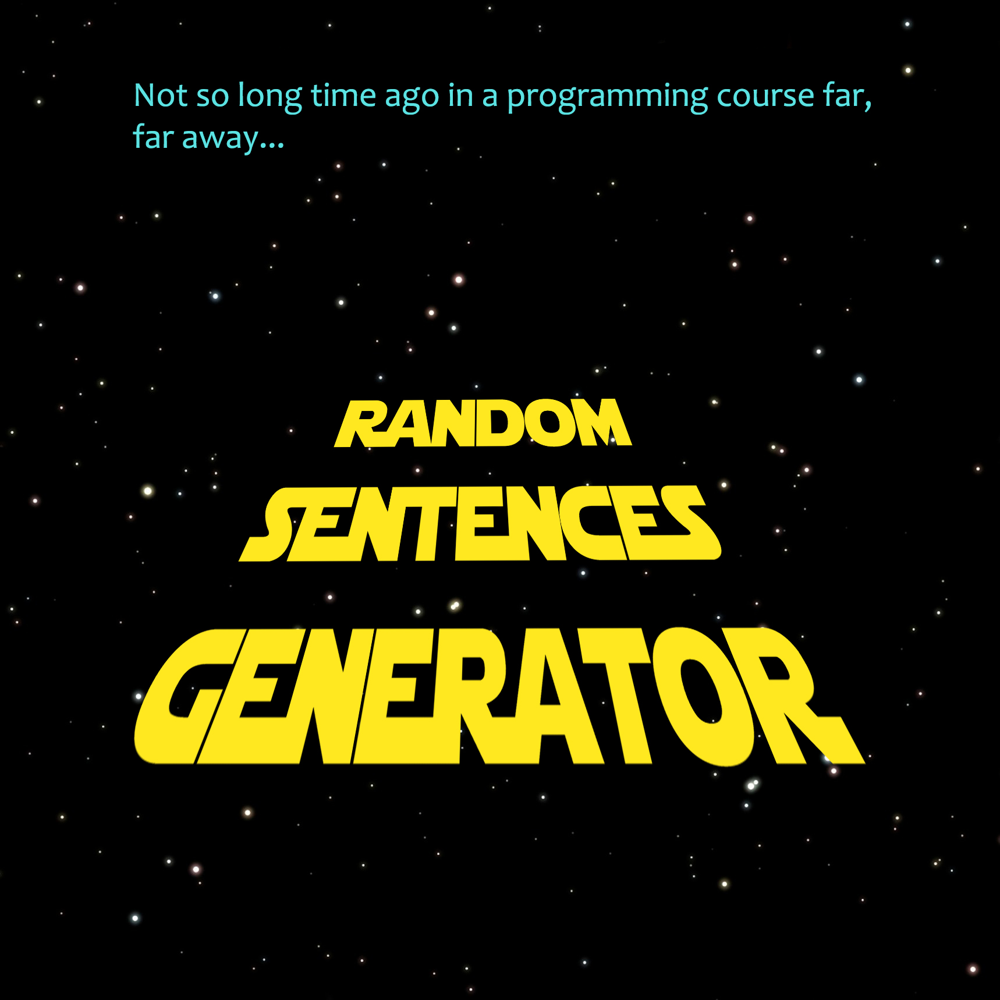
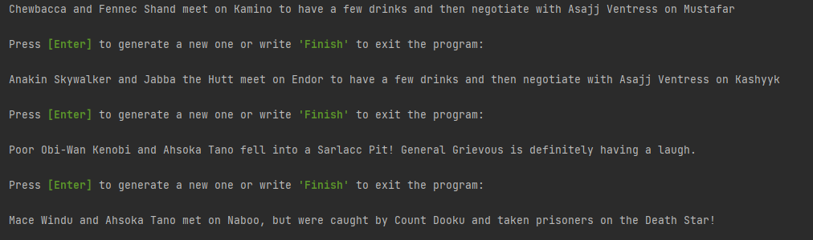
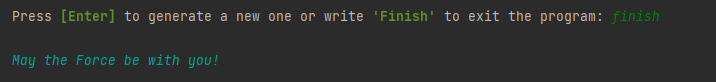

# "Random Sentences Generator" mini project

A student project for a program that generates random Star Wars themed sentences with a template structure. 

**Random Sentences Generator** is a program that generates a random sentence based on a certain template structure and a database of words. Certain words trigger additional different sentence responses.

## Structure in Python

### Defining the function

A function is created that handles all the words lists and generates a random sentence out of those. By using the in-built `random module` each word is randomly selected and then put into use in a formatted string. On a couple occassions the output sentence structure is changed:
- `Sarlacc Pit`
- `Death Star`

The return value is a string with the generated sentence.

### Words lists

Various lists contain the information needed to form a full sentence. The whole random sentence includes:
- a light force character
- a neutral sidekick character
- a dark force character
- a meeting place for the main and side characters
- a place where the first 2 characters meet with the villain
- a list of actions for when the main and side characters meet
- a list of actions for when the first 2 characters meet the villain

### Program logic and user interaction
The defined sentence generator function is used in a `while loop` to generate sentences until the user stops the process. The user is prompted with 2 choices - press **Enter** or write **Finish** (case insensitive) to end the program.

If the user chooses to end the program, it prints out a final message and the program stops.

## Important Links

**Link to the source code** - [Source code](random_sentences_generator.py)

**Replit live demo** - ["Random Sentences Generator" Demo](https://replit.com/@WolfeRTs/randomsentencesgenerator#main.py)
